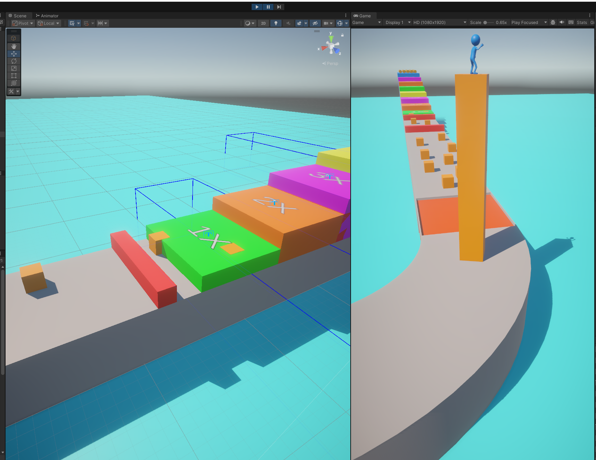
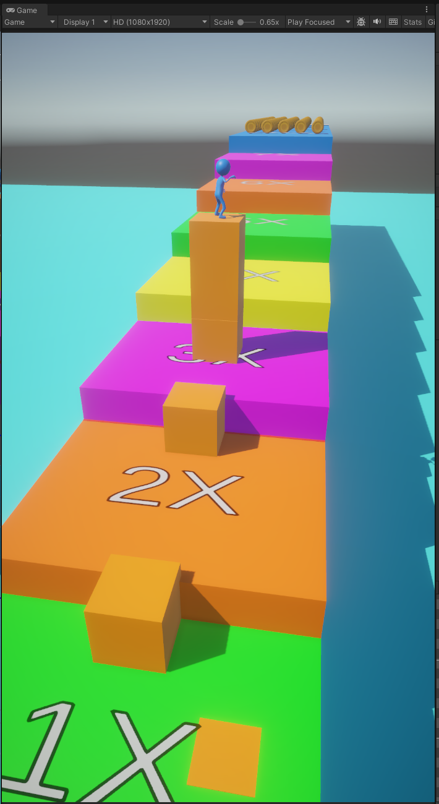

# CubeSlide — Cube Surfer®-style Hyper-Casual Clone (Unity)

> A from-scratch recreation of the core “swerve + stack” mechanic inspired by **Cube Surfer®**. Built to practice Unity/C# gameplay architecture, clean input handling, and simple level interactions.  

## Screenshots




---

## Overview

- **Engine:** Unity  
- **Language:** C# (primary), some ShaderLab  
- **Goal:** Collect cubes to build a stack under the player, avoid/consume obstacles, and reach the finish.  
- **Why:** Learning project focused on mobile-friendly controls, object interactions, and lightweight game flow. 

---

## Gameplay

- The player **auto-moves forward**.
- **Swerve** left/right by dragging to steer.
- **Collect cubes** to increase the stack under the character.
- **Walls/obstacles** consume cubes. If you don’t have enough height, you fail.
- Cross the **finish line** to complete the level.

**Controls**
- **Mobile:** Drag left/right.
- **Editor/PC:** Drag with the mouse (touch simulated).

---

## Features

- Smooth **swerve input** & horizontal movement
- Dynamic **stacking** of collected cubes
- **Obstacle** logic that reduces the stack on collision
- Simple **camera follow**
- **Game Manager** to handle states (start / game over / restart) and UI

---

## Project Structure & Key Scripts

> Core scripts that drive the main loop and interactions:

- `PlayerController.cs` — Player forward motion & high-level interactions
- `SwerveInput.cs` / `SwerveMovement.cs` — Touch/mouse delta capture and lateral movement
- `CollectableCube.cs` — Behavior for pick-up cubes
- `Collector.cs` — Adds collected cubes to the **stack** under the player
- `Obstacle.cs` — Handles stack reduction / failure conditions on hit
- `CameraFollow.cs` — Keeps the camera tracking the player
- `GameManager.cs` — Game state + lightweight UI management

> **Scene:** e.g., `Assets/Scenes/SampleScene.unity` (update if different)

---

## Getting Started

1. **Clone**
   ```bash
   git clone https://github.com/cakmakbm/CubeSlide.git
   cd CubeSlide
